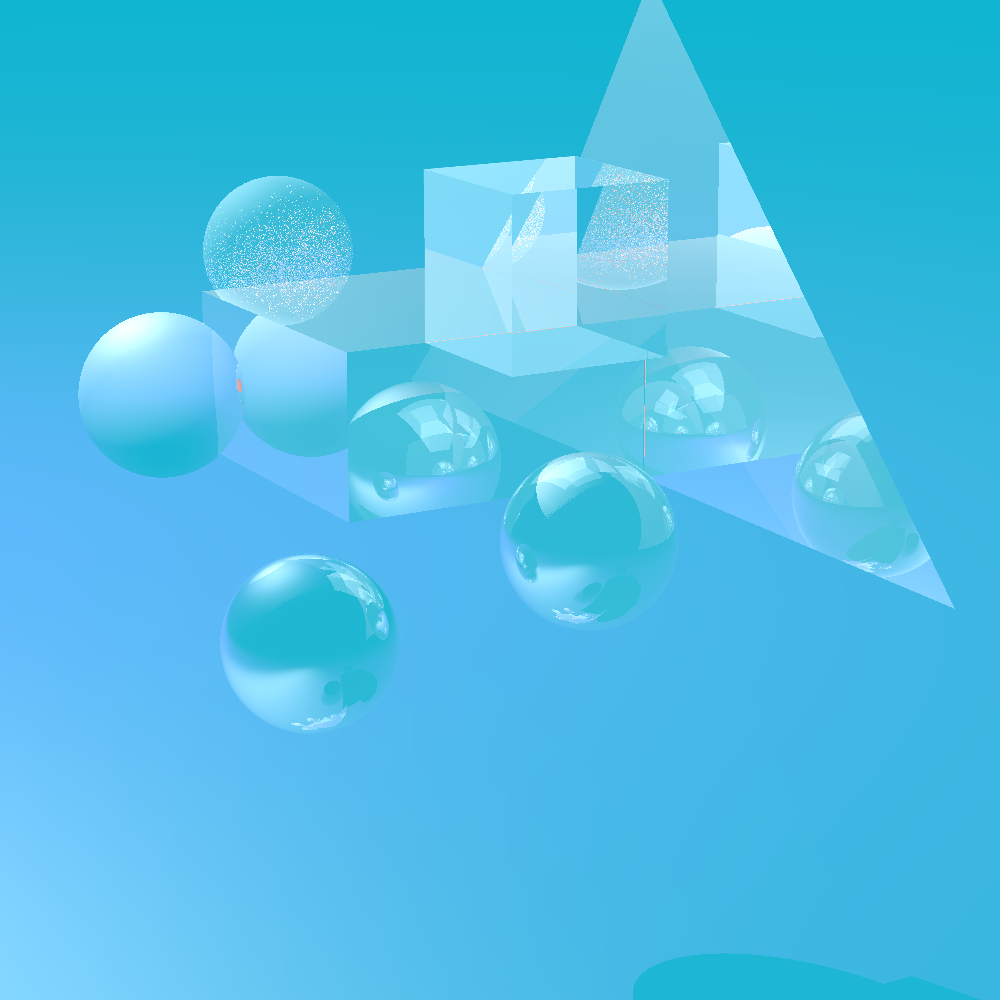
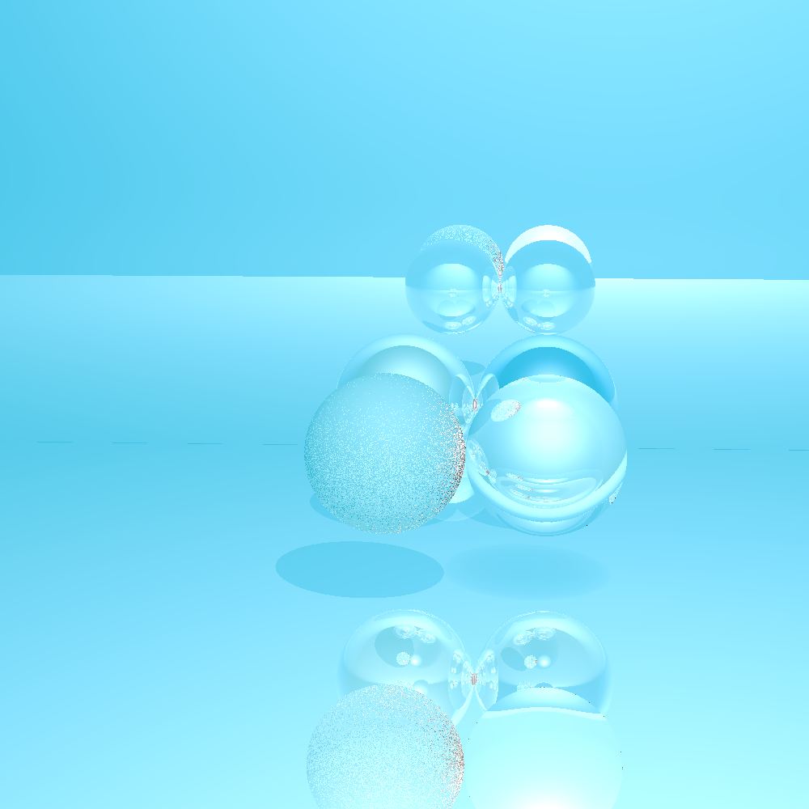
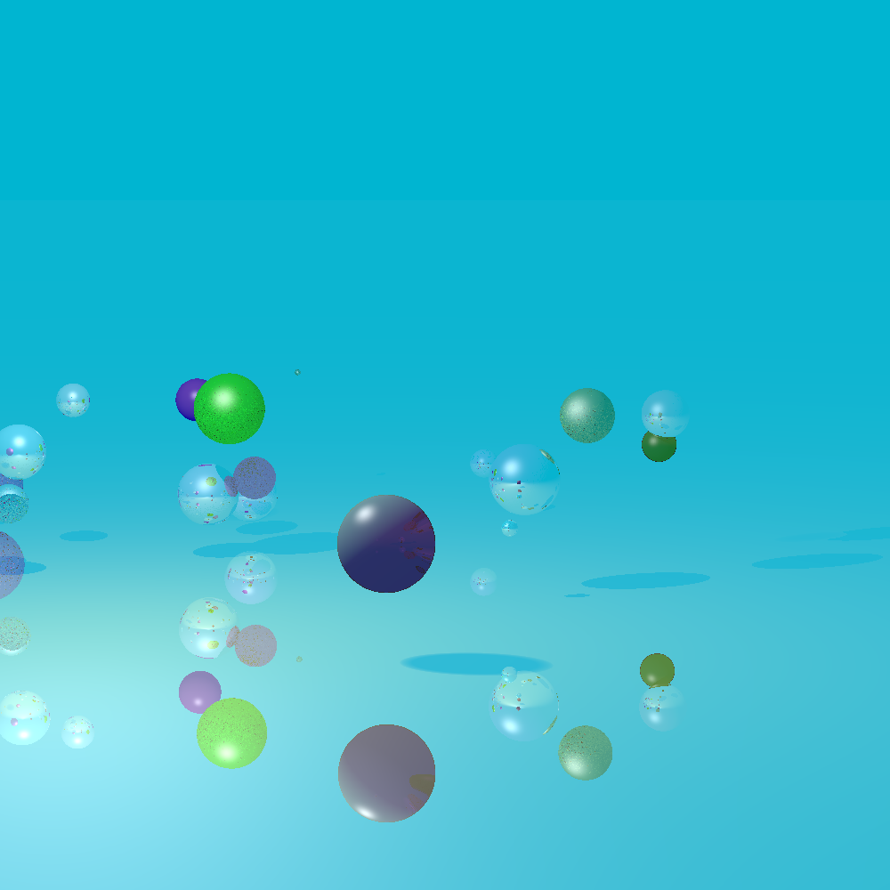

# RayTracing
Programa que se apoya en el QTcreator para visializar una escena gráfica mediante un algoritmo Raytracing.
El Raytracing implementado da soporte a:
-Algoritmo básico de intersección.
-Cálculo de iluminación y sombras basado en el modelo de Blinn-Phong (aplicando el factor de sombra para objetos transparentes).
-Cálculo de reflexiones (aplicando una condición de parada de máxima recursividad).
-Cálculo de transparencias basado en la ley de Snell.
-Tres tipos de materiales: difuso, especular y transparente.
-Luces básicas: ambiente global y luz puntual.
-Cinco Objetos de escena: Esfera, plano, triángulo, cubo y objeto frontera basado en triángulos. 
Some Screenshots

